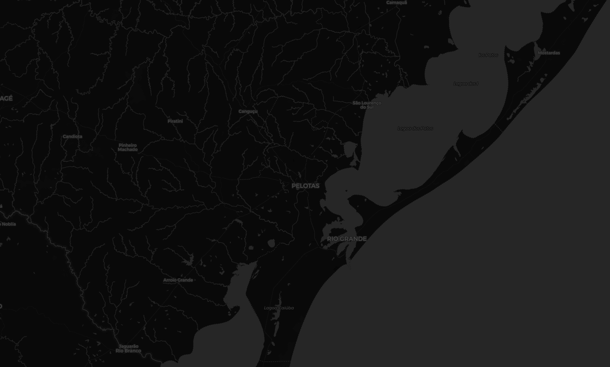
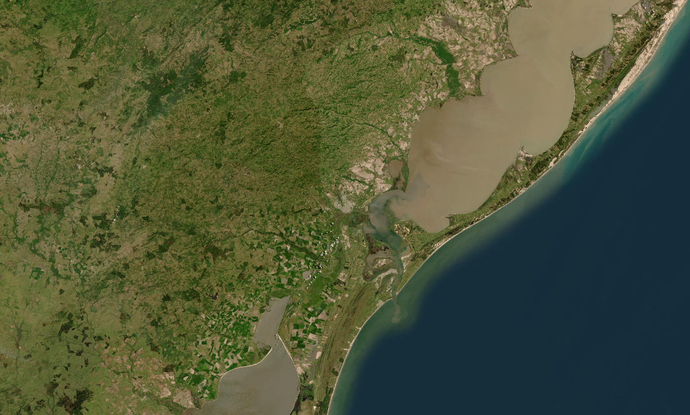
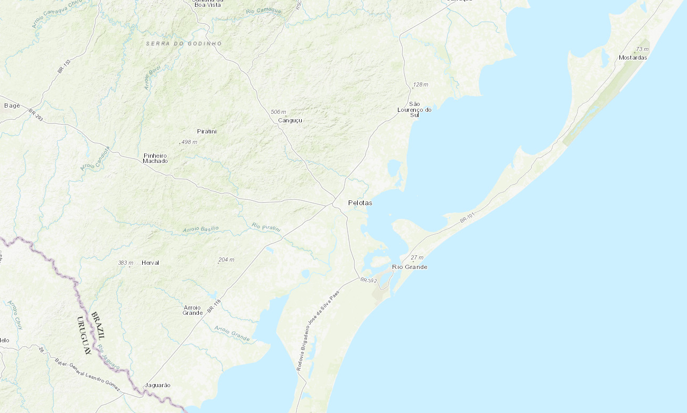

<!-- ### React Leaflet MapContainer and Tile Layers -->

Welcome back! In today's post, we’ll discuss how to use React with the [React Leaflet](https://react-leaflet.js.org/) library to display maps in our applications.

In React Leaflet, the `MapContainer` component is a wrapper that serves as the parent container for the Leaflet map and its child components, such as tile layers, markers, popups, and other overlays. It initializes the Leaflet map instance and manages its lifecycle. For this example, we will use the following `MapContainer` props:

- **center**: The initial geographical center of the map (latitude and longitude).
- **zoom**: The initial zoom level of the map.
- **style** or **className**: Used to apply styles to the map container (e.g., width and height).
- **scrollWheelZoom**: Determines whether the user can zoom using the scroll wheel.

On the other hand, the `TileLayer` component represents a tile layer, which is a type of map layer used to display map tiles from a specific source, such as OpenStreetMap, Google Maps, or custom tile servers. It is essential for rendering the base map, which provides the visual representation of geographical data. For this example, we will use the following `TileLayer` props:

- **url**: The URL template for fetching tiles. The template can include placeholders like `{s}`, `{z}`, `{x}`, and `{y}` for subdomains, zoom level, and tile coordinates.
- **attribution**: A string containing the attribution text for the map data.

The [project](https://github.com/peruzzoarthur/posts/tree/master/map-container-tile-layer) I’ll be sharing today is a React TypeScript app set up with [Vite and Tailwind CSS](https://tailwindcss.com/docs/guides/vite). This post will demonstrate how to set up a map container and load different tile layers.

Stay tuned for more posts in this series, where I’ll dive deeper into React components and share additional insights into my journey in web development!

---

#### Code Example

First, let’s install React Leaflet and update React to its latest version (React Leaflet 5.x requires React 19):

```bash
npm install react@rc react-dom@rc leaflet
npm install react-leaflet@next
```

Next, install the Leaflet type definitions:

```bash
npm install -d @types/leaflet
```

To properly display the `MapContainer`, we need to import Leaflet’s CSS file and ensure the map container has a specified height and width:

```typescript
import "leaflet/dist/leaflet.css";
import { MapContainer } from "react-leaflet";

function App() {
  return (
    <div className="w-screen h-screen p-12">
      <MapContainer className="h-full w-full" />
    </div>
  );
}

export default App;
```

In the above code, we’ve imported the `leaflet.css` file and set a size for the container. For demonstration purposes, the `div` uses Tailwind CSS utility classes to occupy the entire screen (`w-screen h-screen`) with padding (`p-12`) for a windowed style. The `MapContainer` is set to fill the entire `div` by using the `h-full w-full` classes. In other use cases, you can customize the container dimensions to suit your specific needs.

Notice that the `MapContainer` is currently self-closing, but the real power of React Leaflet lies in adding child components to it. Let’s now add a `TileLayer` to visualize an OpenStreetMap based map.

```typescript
import "leaflet/dist/leaflet.css";
import { MapContainer, TileLayer } from "react-leaflet";

function App() {
  return (
    <div className="w-screen h-screen p-12">
      <MapContainer center={[0, 0]} zoom={4} className="h-full w-full">
        <TileLayer
          attribution='&copy; <a href="https://www.openstreetmap.org/copyright">OpenStreetMap</a> contributors'
          url="https://{s}.tile.openstreetmap.org/{z}/{x}/{y}.png"
        />
      </MapContainer>
    </div>
  );
}

export default App;
```

In this example, the `TileLayer` is used to fetch and display map tiles from OpenStreetMap. The url prop specifies the source for the tiles, while the attribution prop provides proper credit to the map data contributors.

With this setup, you’ll have a fully functional map displaying OpenStreetMap tiles. From here, you can enhance the map further by adding additional layers, markers, popups, or other React Leaflet components—topics we’ll explore in future tutorials. You can also experiment with different tile layer URLs to incorporate unique styles or satellite-based imagery into your application.

For instance, in my application, [cgis](https://cgis.up.railway.app/) I implemented a feature that allows users to toggle between distinct tile styles: dark mode, terrain, and satellite imagery. While these are the current options, more styles will be added as the project is still under construction. This functionality ensures the map can adapt seamlessly to various use cases, whether you're designing for night-mode environments, analyzing geographic features, or viewing high-resolution satellite imagery.

#### Use case: `ContextMenu` with multiple `TileLayer` options

To create visually distinct tile layers, I used a React `useState` hook to store the values for the `attribution` and `url`.

```typescript
export type TileLayerOptions = {
  attribution: string;
  url: string;
};

const [tileLayerOptions, setTileLayerOptions] = useState<TileLayerOptions>({
  attribution:
    '&copy; <a href="https://www.openstreetmap.org/copyright">OpenStreetMap</a> contributors',
  url: "https://{s}.basemaps.cartocdn.com/dark_all/{z}/{x}/{y}{r}.png",
});
```

The state setter is provided as a prop to the `ContextMenu` component, enabling users to choose their preferred map style. Although the code includes additional functionality, this explanation will focus on the `ContextMenu`, the state management via the `onSelect` handler, and the `setTileLayerOptions` function.

```typescript
type TileLayerProps = {
  featureCollection?: FeatureCollectionWithFilenameAndState;
  filename: string;
  setTileLayerOptions: React.Dispatch<TileLayerOptions>;
};

export const TileLayer = ({
  featureCollection,
  filename,
  setTileLayerOptions,
}: TileLayerProps) => {

  return (
    <div className="flex w-full items-center space-x-1 cursor-pointer">
      <ContextMenu>
        <ContextMenuTrigger>
          <div className="flex space-x-1 hover:bg-white hover:bg-opacity-0">
            <p className="text-sm">{filename}</p>
            <Map />
          </div>
        </ContextMenuTrigger>
        <ContextMenuContent className="z-[1000]">
          <ContextMenuItem
            onSelect={() => {
              setTileLayerOptions({
                attribution:
                  '&copy; <a href="https://www.openstreetmap.org/copyright">OpenStreetMap</a> contributors',
                url: " https://{s}.basemaps.cartocdn.com/dark_all/{z}/{x}/{y}{r}.png",
              });
            }}
          >
            Dark
          </ContextMenuItem>
          <ContextMenuItem
            onSelect={() => {
              setTileLayerOptions({
                attribution:
                  "Tiles &copy; Esri &mdash; Source: Esri, i-cubed, USDA, USGS, AEX, GeoEye, Getmapping, Aerogrid, IGN, IGP, UPR-EGP, and the GIS User Community",
                url: "https://server.arcgisonline.com/ArcGIS/rest/services/World_Imagery/MapServer/tile/{z}/{y}/{x}",
              });
            }}
          >
            Satellite
          </ContextMenuItem>
          <ContextMenuItem
            onSelect={() => {
              setTileLayerOptions({
                attribution:
                  "Tiles &copy; Esri &mdash; Source: USGS, NOAA",
                url: "https://server.arcgisonline.com/arcgis/rest/services/World_Topo_Map/MapServer/tile/{z}/{y}/{x}"
              });
            }}
          >
           Terrain
          </ContextMenuItem>
        </ContextMenuContent>
      </ContextMenu>
    </div>
  );
};
```

In this code block, the `onSelect` handler is used within each `ContextMenuItem` to update the map's tile layer dynamically. When a user selects a menu item (e.g., "Dark," "Satellite," or "Terrain"), the `onSelect` function is triggered, executing the `setTileLayerOptions` function with a specific configuration object.

This approach allows the map's tile layer to update dynamically based on the user's selection, providing a seamless and interactive user experience.


Figure 1: Dark styled cartography.


Figure 1: Satellite image.


Figure 1: Terrain cartography.

Check out the video to see this feature in action within the app! Feel free to explore [cgis](https://cgis.up.railway.app/) and share your thoughts with me. I’d love to hear your feedback and gain insights from the community's perspective on my project.

<div class="video-container">
    <iframe 
        src="https://www.youtube.com/embed/46BPHtynJak"
        frameborder="0" 
        allow="accelerometer; autoplay; clipboard-write; encrypted-media; gyroscope; picture-in-picture" 
        allowfullscreen>
    </iframe>
</div>

#### Summary

In this post, we explored the foundational component of React Leaflet, the MapContainer, and demonstrated how to use the TileLayer component to customize map styles with imagery from various sources. This serves as a solid starting point for creating more advanced and interactive mapping features, which we’ll cover in the upcoming tutorials in this series.
