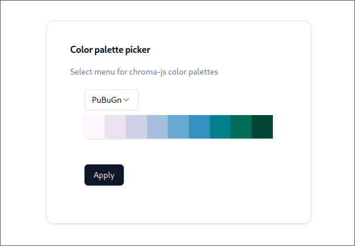
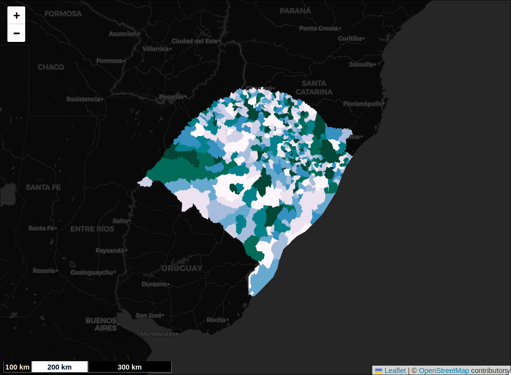

<!-- ### React Chromajs SelectMenu Card with ShadCN UI Components -->

I’m excited to announce that I’ve finally decided to put my blog project into action and start sharing my work with the community! This post marks the beginning of a series of blog entries that I’ll be publishing here in the future.

My first series will focus on the React components I’ve been building for my projects. One of the core principles of components is reusability—they’re designed to be implemented across various parts of the same app, and even across multiple applications. In today’s post, I’ll share a component I created: a color palette picker built with React, integrating the Chroma.js library with ShadCN UI elements and React state management.

Colors are incredible for styling components, but they can also be tricky to work with. Maintaining harmony between chosen colors is a delicate task. Fortunately, there are many tools available to help with this challenge. Some are built directly into component libraries (such as ShadCN’s straightforward methods for theming and styling), while others come as external libraries and resources.

When I need inspiration or ideas for color combinations, I often turn to [Color Hunt](https://colorhunt.co/), a fantastic platform for exploring color styles. However, in a recent project involving [React Leaflet](https://react-leaflet.js.org/) and interactive maps, I found myself needing color palettes with more than the standard four-color schemes offered by Color Hunt. As a developer—not a designer—it can be a real challenge to come up with harmonious color palettes (shoutout to designers for making styling look effortless!).

This need for larger, well-balanced color palettes led me to discover the [Chroma.js](https://www.npmjs.com/package/chroma-js) library. Chroma.js is an exceptional library for working with colors, offering a wide range of utility functions for various use cases. If you’re interested in working with colors in your projects, I highly recommend checking out its [documentation](https://www.vis4.net/Chroma.js/).

While exploring Chroma.js, I came across <code>chroma.brewer</code>, a feature that generates color palettes using [ColorBrewer palettes](https://colorbrewer2.org/). These palettes are widely used in Geographic Information Systems ([GIS](https://en.wikipedia.org/wiki/Geographic_information_system)) for creating visually appealing and functional maps—making them a perfect fit for my use case (you’ll find some examples at the end of this post).

The project I’ll be sharing today is a React TypeScript app set up with [Vite and ShadCN UI](https://ui.shadcn.com/docs/installation/vite). It features a reusable [Card](https://ui.shadcn.com/docs/components/card) component containing a [Select](https://ui.shadcn.com/docs/components/select) menu for picking color palettes, along with a row of [Badges](https://ui.shadcn.com/docs/components/badge) for previewing the selected colors. The selected palette is stored in React state, making it easy to use elsewhere in the application.

Stay tuned for more posts in this series, where I’ll dive deeper into React components and share additional insights into my journey in web development!

#### Code

- First, install Chroma.js and its type definitions

```bash
npm install chroma-js
npm install -D @types/chroma-js
```

- Install shadcn/ui components

```bash
npx shadcn@latest add badge button card select
```

- Define type for brewer palettes

```typescript
export type BrewerPaletteKey = keyof typeof brewer;
```

For being able to ensure that we are getting the right objects from the helper function, we need to get the keys from the type defined for <code>brewer</code>.
<code>keyof</code> will get the keys from <code>typeof</code>, the type that corresponds from the helper function.

- Create a select menu at src/components/ChromaSelectMenu.tsx

```typescript
import { brewer } from "chroma-js";
import {
  Select,
  SelectContent,
  SelectItem,
  SelectTrigger,
  SelectValue,
} from "./ui/select";
import { BrewerPaletteKey } from "./ChromaCard";

type ChromaSelectMenuProps = {
  brewerPalette: BrewerPaletteKey | undefined;
  setBrewerPalette: React.Dispatch<
    React.SetStateAction<BrewerPaletteKey | undefined>
  >;
};

export const ChromaSelectMenu = ({
  brewerPalette,
  setBrewerPalette,
}: ChromaSelectMenuProps) => {
  return (
    <Select
      defaultValue={brewerPalette}
      onValueChange={(value) => setBrewerPalette(value as BrewerPaletteKey)}
    >
      <SelectTrigger className="w-auto">
        <SelectValue placeholder={brewerPalette || "Select palette"} />
      </SelectTrigger>
      <SelectContent>
        {Object.keys(brewer).map((palette) => (
          <SelectItem key={palette} value={palette}>
            {palette}
          </SelectItem>
        ))}
      </SelectContent>
    </Select>
  );
};
```

<code>ChromaSelectMenu</code> component is a dropdown menu built with the <code>Select</code> component, which allows users to choose a color palette from the <code>brewer</code> object. The <code>defaultValue</code> prop sets the initial selected palette using <code>brewerPalette</code> state, and the <code>onValueChange</code> handler updates <code>brewerPalette</code> when the user select a new item, ensuring type safety by casting the value to <code>BrewerPaletteKey</code>. The options for the menu are dynamically generated using <code>Object.keys(brewer)</code>, which retrieves all the palette names (keys) from the <code>brewer</code> object and maps them to <code>SelectItem</code> components.

- Create colors bar at src/components/ChromaPaletteBar.tsx

```typescript
import { brewer } from "chroma-js";
import { Badge } from "./ui/badge";
import { BrewerPaletteKey } from "./ChromaCard";

type ChromaPaletteBarProps = {
  brewerPalette: BrewerPaletteKey;
};

export const ChromaPaletteBar = ({ brewerPalette }: ChromaPaletteBarProps) => {
  return (
    <div className="flex justify-center items-center w-full">
      {brewer[brewerPalette].map((color, index) => (
        <Badge
          key={index}
          style={{ backgroundColor: color }}
          className="h-10 w-10 border-none rounded-none"
        />
      ))}
    </div>
  );
};
```

Badges are small, versatile UI components often used to display compact, visually distinct pieces of information, such as labels, statuses, counts, or categories. In the example provided, badges are being used to create a color palette bar, where each badge represents a single color from the selected <code>brewerPalette</code>. This demonstrates their flexibility, as they can be styled dynamically using properties like <code>backgroundColor</code> and other custom css classes, to visually communicate different states or data.

- Create the card component at src/components/ChromaCard.tsx

```typescript
import { brewer } from "chroma-js";
import {
  Card,
  CardContent,
  CardDescription,
  CardFooter,
  CardTitle,
} from "./ui/card";
import { useState } from "react";
import { Button } from "./ui/button";
import { ChromaSelectMenu } from "./ChromaSelectMenu";
import { ChromaPaletteBar } from "./ChromaPaletteBar";

export type BrewerPaletteKey = keyof typeof brewer;

export const ChromaCard = () => {
  const [brewerPalette, setBrewerPalette] = useState<BrewerPaletteKey | undefined>(
    undefined,
  );

  return (
    <Card className="w-[50vh] h-auto p-10 space-y-5">
      <CardTitle>Color palette picker</CardTitle>
      <CardDescription>
        Select menu for chroma-js color palettes
      </CardDescription>
      <CardContent className="space-y-2">
        <ChromaSelectMenu
          brewerPalette={brewerPalette}
          setBrewerPalette={setBrewerPalette}
        />
        {brewerPalette && <ChromaPaletteBar brewerPalette={brewerPalette} />}
      </CardContent>
      <CardFooter>
        <Button>Apply</Button>
      </CardFooter>
    </Card>
  );
};
```

Cards are highly flexible UI components used to group related content and actions within a defined container, providing a visually organized and modular design. In the <code>ChromaCard</code> component, the card encapsulates a color palette picker, including a title, description, a dropdown menu (<code>ChromaSelectMenu</code>), and a visual color bar (<code>ChromaPaletteBar</code>). The <code>useState</code> hook is utilized to manage the internal state of the selected color palette (<code>brewerPalette</code>), allowing the component to respond dynamically to user input and re-render when the palette changes.


Figure 1: Example of the created component with Purple-Blue-Green color palette selected.

The modularity of <code>ChromaCard</code> makes it reusable across various applications. For instance, in my use case of creating a GIS data visualization app, this component can be adapted, for example, to manage and display different palettes for styling maps, graphs, or charts.

#### Use case: [cgis](https://cgis.up.railway.app/) styling feature for GeoJSON data

To create visually distinguishable colors for different geospatial datasets in my application, I utilized the component described above to generate color palettes, which are then applied to loaded GeoJSON files. In the near future, I plan to write a series of posts delving deeper into this implementation, exploring key concepts of web GIS and providing insights into the development process of my application.


Figure 2: Purple-Blue-Green palette applied to polygons of municipalities of Rio Grande do Sul, Brazil.

#### Summary

This post introduces a React component for selecting and previewing color palettes using the Chroma.js library and ShadCN UI components. The component includes a dropdown menu to select color palettes (leveraging Chroma.js's brewer palettes) and a color bar displaying the selected palette as badges.
